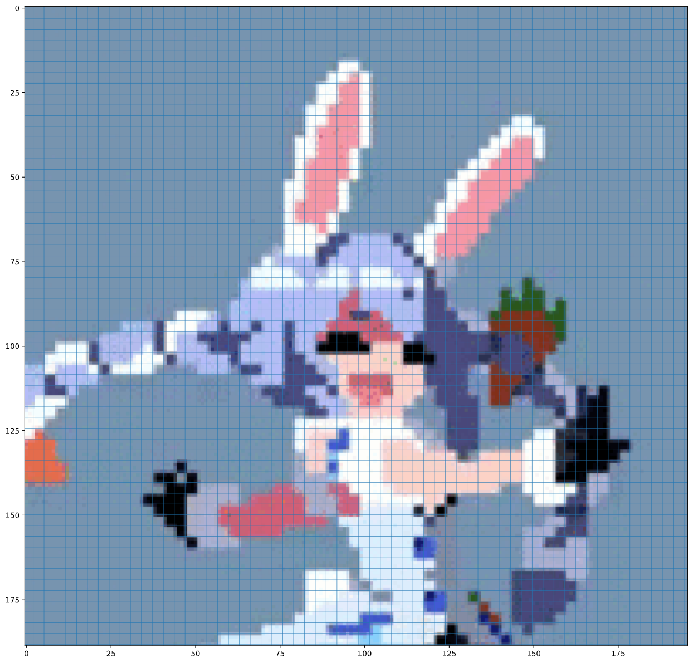

# repixel
## Convert a scaled jpeg of pixel art into pixel perfect bitmap

Source image             |  Image with Grid           | Result
:-------------------------:|:-------------------------:|:----:
  |  | 

# what is repixel?

Given an image of scaled up pixel art which has been affected by:

* jpeg compression resulting in artifacts
* aliasing due to imperfect scaling
* edges being between pixels resulting in fringing and low quality visuals

`repixel` aims to recover the original pixels of the source image. It does this through a few major steps:

1. Use sobel filters to highlight edges. 
    1. The absolute value is taken, and a mean is taken to aggregate all the edges on the page.
    2. peaks are found in the resulting signal, subject to a user tuned threshold parameter
2. the original pixel grid is computed via 1D grid search
    1. the original pixel size is estimated manually as a range between `[min_size, max_size]`
    2. this gives us a range of possible grids to search through between highlighted edges
    3. Hungarian algorithm using MSE cost is used to find the most cost effective matching between peaks and grid lines
    4. the grid that results in the lowest MSE is returned
    5. the grid is extrapolated to the edges of the image
3. for each square in the grid, the colour of the grid is estimated using the median of all colour tuples in that grid

# Usage

1. Put the image you want to rescale to original resolution in the `./src` directory.
2. Go to the `./scripts/recover_pixels.ipynb` and ensure your file is read in the second code block
3. change the `threshold` variable for `sobel_edges` function until only true edges are found (see the example image or the example in this readme for what the gridlines should look like)
4. the last code block should generate the image at the original pixel art's resolution.

# Goals

I have completed the first 2 main goals. However, the colouring of the pixels has been troubling me, and I haven't found a clean method for extracting the original colour of the pixels at the calculated grids.

- [x] Find edges between pixels in image
- [x] Create an equally spaced grid from the edges found
- [x] Estimate the colour of each grid pixel from the source scaled image
    - [x] use median of source pixels in grid cell
    - [ ] use clustering to group similar colours together for a more consistent view
    - [ ] use location based clustering when colouring pixels to ensure local colour consistency
    - [ ] use grid lines with guassian weighting to highlight the centers of pixels, and calculate the mean from multiple pixels of the same color.

# Useful Resources

- [numpy.diff](https://numpy.org/doc/stable/reference/generated/numpy.diff.html)
- [scipy.signal.find_peaks](https://docs.scipy.org/doc/scipy/reference/generated/scipy.signal.find_peaks.html)
- [stackoverflow: Best match between two sets of points](https://stackoverflow.com/questions/52500239/best-match-between-two-sets-of-points)
- [scipy.optimize.linear_sum_assignment](https://docs.scipy.org/doc/scipy-0.18.1/reference/generated/scipy.optimize.linear_sum_assignment.html)
- [numpy.median](https://numpy.org/doc/stable/reference/generated/numpy.median.html)
- [sklearn.cluster](https://scikit-learn.org/stable/modules/classes.html#module-sklearn.cluster)

## Failed Attempts

Here is some documentation on some my previous failed attempts at solving this problem

* use `np.diff` to simulate the derivative of the image, and look at each row to find potential edges. (inconsistent, resulted in doubled lines)
* assume grids start from the start and end of the image, estimate pixel size to brute force a series of possible original grid resolutions, scale up image to source image size and calculate similarity index, return the result with largest simularity to source scaled image. (images would appear soft and nothing like source image)
* given the edges from find_peaks on sobel, take the histogram of all edges, hand pick threshold of edges to consider the length of single pixel widths, use this calculation to extrapolate larger widths to produce a full grid (worked well, but required extensive model tuning)
* use clustering algorithsm (K-means, mean shift) to group colours and only assign the median of colours found (slow, low k increases sharpness but a lot of colours are lost, high k decreases sharpness and preserves more colours)
